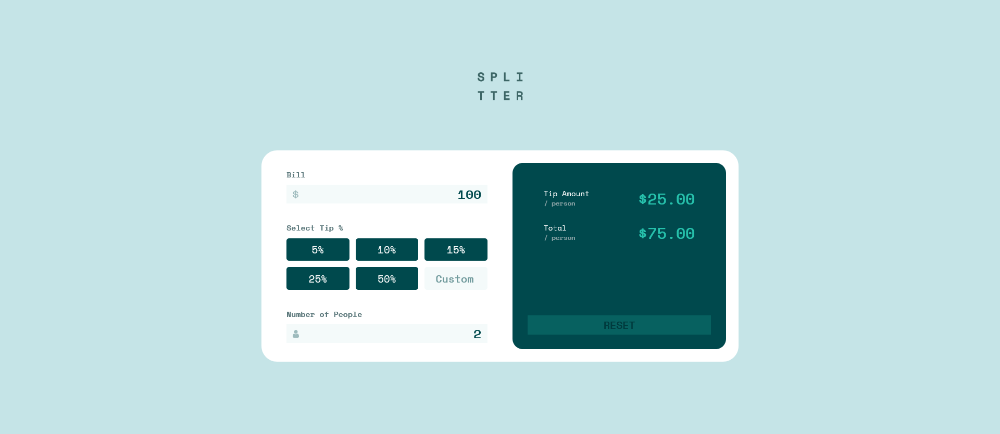

# Frontend Mentor - Tip calculator app solution

This is a solution to the [Tip calculator app challenge on Frontend Mentor](https://www.frontendmentor.io/challenges/tip-calculator-app-ugJNGbJUX). Frontend Mentor challenges help you improve your coding skills by building realistic projects.

## Table of contents

- [Overview](#overview)
  - [The challenge](#the-challenge)
  - [Screenshot](#screenshot)
  - [Links](#links)
- [My process](#my-process)
  - [Built with](#built-with)
  - [What I learned](#what-i-learned)
  - [Continued development](#continued-development)
  - [Useful resources](#useful-resources)
- [Author](#author)
- [Acknowledgments](#acknowledgments)

**Note: Delete this note and update the table of contents based on what sections you keep.**

## Overview

### The challenge

Users should be able to:

- View the optimal layout for the app depending on their device's screen size
- See hover states for all interactive elements on the page
- Calculate the correct tip and total cost of the bill per person

### Screenshot

Add a screenshot of your solution. The easiest way to do this is to use Firefox to view your project, right-click the page and select "Take a Screenshot". You can choose either a full-height screenshot or a cropped one based on how long the page is. If it's very long, it might be best to crop it.

Alternatively, you can use a tool like [FireShot](https://getfireshot.com/) to take the screenshot. FireShot has a free option, so you don't need to purchase it. 

Then crop/optimize/edit your image however you like, add it to your project, and update the file path in the image above.

**Note: Delete this note and the paragraphs above when you add your screenshot. If you prefer not to add a screenshot, feel free to remove this entire section.**

### Links

- Live Site URL:(https://jonathancout.github.io/Front-End-Mentor/tip-calculator-app-main/)

## My process

### Built with

- Semantic HTML5 markup
- CSS custom properties
- Flexbox
- CSS Grid
- Mobile-first workflow
- JavaScript

### What I learned

Creating the webdesign is still a bit of a challenge for me. But it was really good to revise some things that i learned a bit ago. 

### Continued development

I wish to keep getting more confortable with CSS/SCSS and creating the designs for my landing pages. I'll probably get back on this project after i learn how to code in React, to create a better version of it.

### Useful resources

- [Documentation](https://developer.mozilla.org/en-US/) - The documentation already helped me in so many times that i lost count. If you're having any trouble on how to use a certain method, i highly suggest that you keep an eye on there.

## Author

- LinkedIn - [Jonathan Quintal Coutinho](https://www.linkedin.com/in/jqc-eng/)
- Frontend Mentor - [@JonathanCout](https://www.frontendmentor.io/profile/JonathanCout)
- Twitter - [@CoutinhoJhony](https://twitter.com/CoutinhoJhony)
